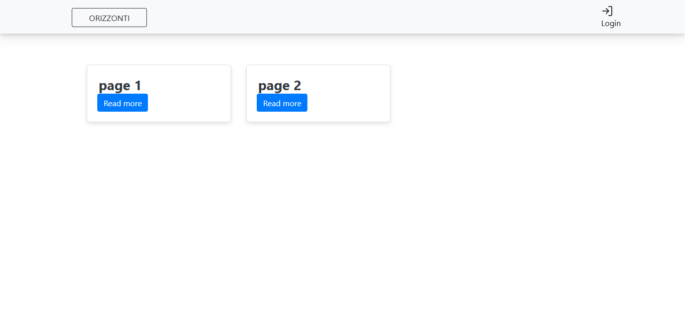
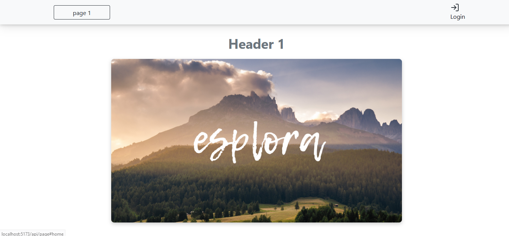
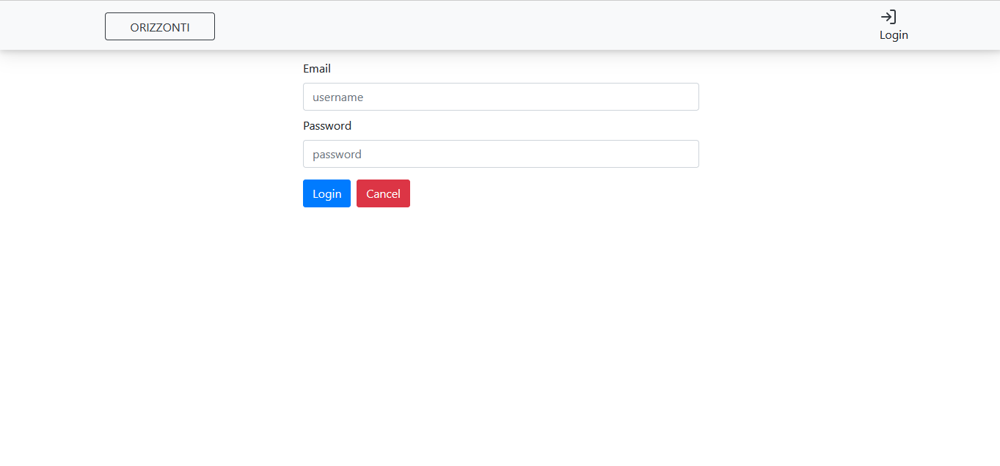
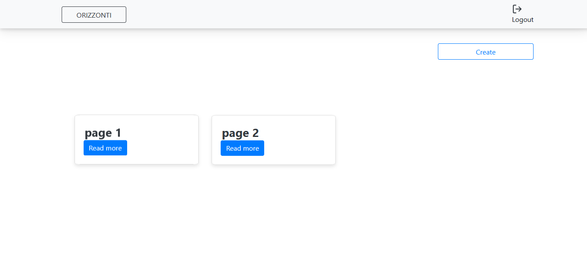
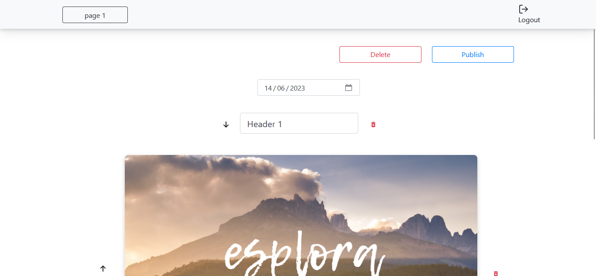
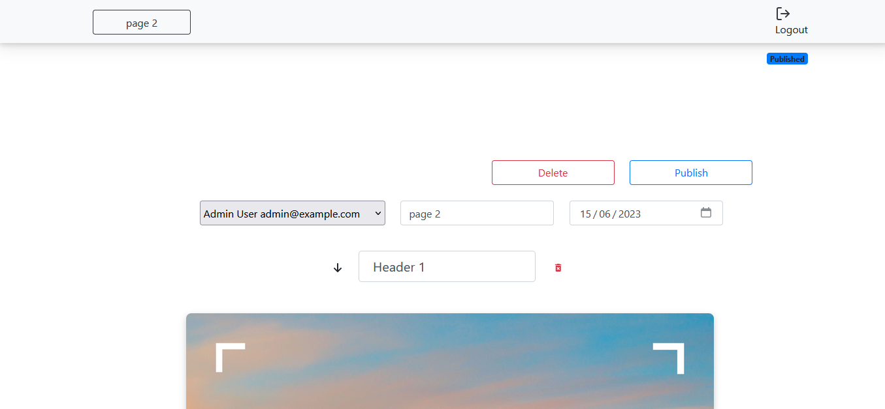

[](https://classroom.github.com/a/suhcjUE-)
# Exam #26/08/2023: "CMS MALL"
## Student: s309572 YOUBISSI KAMDEM GABRIEL 

## React Client Application Routes

- Route `/`: home page front office contain all the pages pubblicated. This pages is public.
- Route `/api/login`: login page
- Route `/api/page`: show the selected page (the front version and the back office dipend of if the user is logged or not)
- Route `/api/page/create`: for teh page creation

## API Server

### Authentication

- POST `/api/session`
  - description : start a session
  - headers: content-type (application/json)
  - request parameters: N/A 
  - request body : username, password
  - response body : "ok"

- DELETE `/api/session/current` 
  - description: end the session
  - headers: N/A
  - request params: N/A
  - request body: N/A
  - response body: page

### Altre

- GET `/api/frontoffice/pages`
  - autenticated: false
  - description: request to get all the pages
  - headers: N/A
  - request params: N/A
  - request body: N/A
  - response body: 

```
[
  {
    "page_data": {
      "page_id": 25,
      "u_id": 2,
      "creation_date": "2023-06-20",
      "publication_date": "2023-06-14",
      "web_site_name": "page 1"
    }
  },
  {
    "page_data": {
      "page_id": 26,
      "u_id": 2,
      "creation_date": "2023-06-20",
      "publication_date": "2023-06-15",
      "web_site_name": "page 2"
    }
  },
  {
    "page_data": {
      "page_id": 28,
      "u_id": 2,
      "creation_date": "2023-06-20",
      "publication_date": "1998-04-17",
      "web_site_name": "LDS"
    }
  },
  {
    "page_data": {
      "page_id": 29,
      "u_id": 2,
      "creation_date": "2023-06-20",
      "publication_date": "1998-04-17",
      "web_site_name": "LDS"
    }
  },
  {
    "page_data": {
      "page_id": 30,
      "u_id": 2,
      "creation_date": "2023-06-20",
      "publication_date": "1999-02-20",
      "web_site_name": "Ahmet"
    }
  },
  {
    "page_data": {
      "page_id": 31,
      "u_id": 2,
      "creation_date": "2023-06-20",
      "publication_date": "2023-06-07",
      "web_site_name": "weee"
    }
  }
]
```

- GET `/api/backoffice/pages`
  - autenticated: true
  - description: request to get all the pages
  - headers: N/A
  - request params: N/A
  - request body: N/A
  - response body:

```
  [
  {
    "page_data": {
      "page_id": 25,
      "u_id": 2,
      "creation_date": "2023-06-20",
      "publication_date": "2023-06-14",
      "web_site_name": "page 1"
    },
    "published": "Published"
  },
  {
    "page_data": {
      "page_id": 26,
      "u_id": 2,
      "creation_date": "2023-06-20",
      "publication_date": "2023-06-15",
      "web_site_name": "page 2"
    },
    "published": "Published"
  },
  {
    "page_data": {
      "page_id": 28,
      "u_id": 2,
      "creation_date": "2023-06-20",
      "publication_date": "1998-04-17",
      "web_site_name": "LDS"
    },
    "published": "Published"
  },
  {
    "page_data": {
      "page_id": 29,
      "u_id": 2,
      "creation_date": "2023-06-20",
      "publication_date": "1998-04-17",
      "web_site_name": "LDS"
    },
    "published": "Published"
  },
  {
    "page_data": {
      "page_id": 30,
      "u_id": 2,
      "creation_date": "2023-06-20",
      "publication_date": "1999-02-20",
      "web_site_name": "Ahmet"
    },
    "published": "Published"
  },
  {
    "page_data": {
      "page_id": 31,
      "u_id": 2,
      "creation_date": "2023-06-20",
      "publication_date": "2023-06-07",
      "web_site_name": "weee"
    },
    "published": "Published"
  }
]
```

- GET `/api/frontoffice/pages/:pageId`
  - autenticated: false
  - description: request to get a spescific page by id
  - headers: content-type (application/json)
  - request params: N/A
  - request body: N/A
  - response body: page basic info (website name , publication date) array (content field)

```
  {
  "page_data": {
    "page_id": 25,
    "u_id": 2,
    "creation_date": "2023-06-20",
    "publication_date": "2023-06-14",
    "web_site_name": "page 1",
    "content": [
      {
        "h_id": 40,
        "p_id": 25,
        "header_content": "Header 1",
        "order": 0
      },
      {
        "h_id": 41,
        "p_id": 25,
        "header_content": "End",
        "order": 2
      },
      {
        "img_id": 11,
        "p_id": 25,
        "img_bank_id": 4,
        "img_path": "4.png",
        "order": 1
      },
      {
        "pg_id": 28,
        "p_id": 25,
        "paragraph_content": "Lorem ipsum dolor sit amet, consectetur adipiscing elit. Sed non risus. Suspendisse lectus tortor, dignissim sit amet, adipiscing nec, ultricies sed, dolor. Cras elementum ultrices diam. Maecenas ligula massa, varius a, semper congue, euismod non, mi. Proin porttitor, orci nec nonummy molestie, enim est eleifend mi, non fermentum diam nisl sit amet erat. Duis semper. Duis arcu massa, scelerisque vitae, consequat in, pretium a, enim. Pellentesque congue. Ut in risus volutpat libero pharetra tempor. Cras vestibulum bibendum augue. Praesent egestas leo in pede. Praesent blandit odio eu enim. Pellentesque sed dui ut augue blandit sodales. Vestibulum ante ipsum primis in faucibus orci luctus et ultrices posuere cubilia Curae; Aliquam nibh. Mauris ac mauris sed pede pellentesque fermentum. Maecenas adipiscing ante non diam sodales hendrerit.",
        "order": 3
      }
    ]
  }
}
```


  - GET `/api/backoffice/feed/:pageId`
    - autenticated: true
    - description: request to get a spescific page by id
    - headers: content-type (application/json)
    - request params: N/A
    - request body: N/A
    - response body:

```
  {
  "page_data": {
    "page_id": 25,
    "u_id": 2,
    "creation_date": "2023-06-20",
    "publication_date": "2023-06-14",
    "web_site_name": "page 1",
    "author_name": "generic 1"
    "content": [
      {
        "h_id": 40,
        "p_id": 25,
        "header_content": "Header 1",
        "order": 0
      },
      {
        "h_id": 41,
        "p_id": 25,
        "header_content": "End",
        "order": 2
      },
      {
        "img_id": 11,
        "p_id": 25,
        "img_bank_id": 4,
        "img_path": "4.png",
        "order": 1
      },
      {
        "pg_id": 28,
        "p_id": 25,
        "paragraph_content": "Lorem ipsum dolor sit amet, consectetur adipiscing elit. Sed non risus.",
        "order": 3
      }
    ]
  },
  "editable": "editable",
  "published": "Published"
}
```


- POST `/api/backoffice/page`
  - autenticata: true
  - description: create a new page
  - headers: content-type (application/json)
  - request params: N/A
  - request body: 
```
{
    "content": [
        {
            "p_id": " ",
            "header_content": "New Header",
            "order": 0,
            "added": true
        },
        {
            "p_id": " ",
            "header_content": "New Header",
            "order": 1,
            "added": true
        },
        {
            "p_id": " ",
            "paragraph_content": "New paragraph",
            "order": 2,
            "added": true
        }
    ],
    "admin": false,
    "web_site_name": "weee",
    "publication_date": "2023-06-07",
    "email": " "
}
```
  - response body: N/A

- POST `/api/backoffice/pages/:page_id`
  - autenticata: true
  - description: update a page
  - headers: content-type (application/json)
  - request params: N/A
  - request body: 
  - response body: N/A

## Database Tables

- Table `users`:
  - id 
  - name 
  - email 
  - hash 
  - salt 
  - type 
 

- Table `pages` :
  - page_id 
  - u_id
  - creation_date
  - publication_date 
  - web_site_name

- Table `headers`:
  - h_id
  - p_id (foreign key page_id reference pages(page_id))
  - header_content


- Table `paragraphs`:
  - pg_id
  - p_id (foreign key page_id reference pages(page_id))
  - paragraph_content


- Table `headers`:
  - img_id
  - img_bank_id (foreign key img_id reference images_bank(img_id))
  - p_id (foreign key page_id reference pages(page_id))
  - img_path

- Table `images_bank`:
  - img_id
  - img_path


## Main React Components

- `PageCards` (in `PageCards.jsx`): show a list of card which redirect to the page of a non logged user
- `PageCardsBackOffice` (in `PageCardsBackOffice.jsx`): show a list of card and the create option, each card redirect to the page of a logged user
- `PageFrontOffice` (in `PageFrontOffice.jsx`): display the page without the possiblity to edit it.
- `PageBackOffice` (in `PageBackOffice.jsx`): display the page with the possiblity to edit it.
- `PageCreate` (in `PageCreate.jsx`): form for page creation.

## Screenshot

### `PageCards`


### `PageFrontOffice`


### `LoginForm`


### `PageCardsBackOffice`


### `PageBackOffice`


### `PageBacklOffice (Admin)`



## Users Credentials

- admin@example.com, ciao 
- user1@example.com, ciao
- user2@example.com, ciao
- user3@example.com, ciao
 

